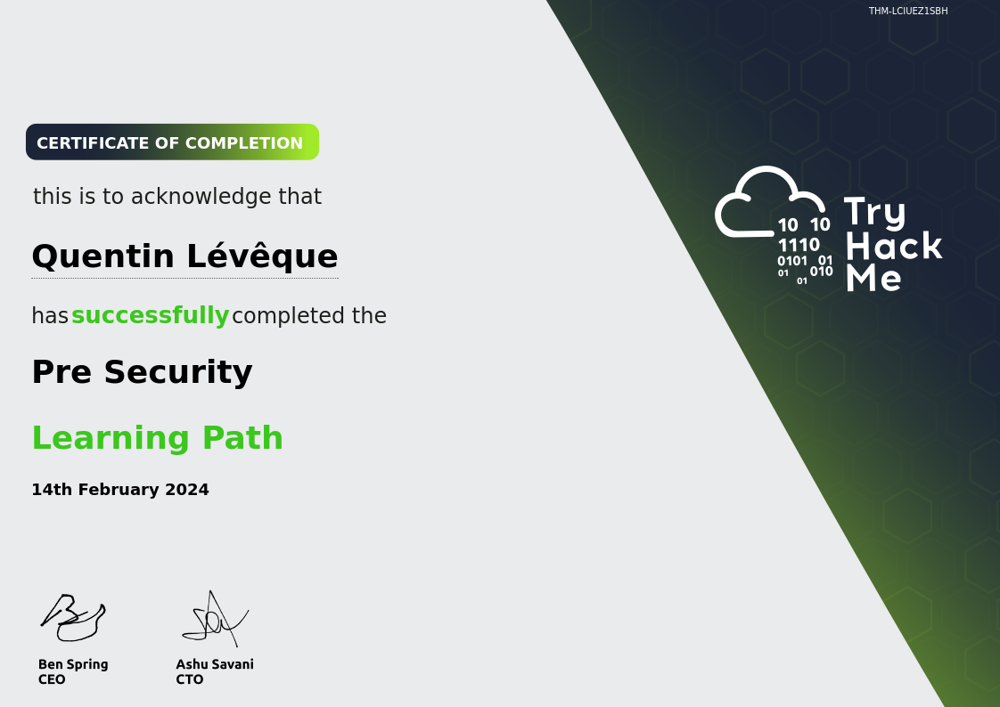

### Hi, I'm Quentin 👋

<!--Start Intro-->               

I am a student in IT interested in all technologies. Currently, I love cybersecurity and am training myself on TryHackMe.

- 🌱 Every day offers a chance to learn, and I'm taking full advantage by exploring diverse subjects.
- 💁‍♂️ Here to grow and thrive.
- 💻 Download my <a href="./CV.pdf" target="_blank">CV</a> for more details about me.
<!--End Intro-->

<!--Languages and Tools Section-->       
## <h2 align="center">🛠️ LANGUAGES AND TOOLS 🛠️</h2> 

 

<!--Trophies Section-->   
## <h2 align="center">🏆 THM CERTIFICATIONS 🏆</h2>

  

  

 

<!--THM stats Table--> 
## <h2 align="center">📊 TRY HACK ME STATS 📊</h2>

  

<!--Github stats Table--> 
## <h2 align="center">📊 GITHUB STATS 📊</h2>

<table width="100%">
  <tr>
    <td width="50%">
      <h3 align="center"><strong>Gɪᴛʜᴜʙ Sᴛᴀᴛs</strong></h3>
      

        
      

    </td>
    <td width="50%">
      <h3 align="center"><strong>Sᴛʀᴇᴀᴋ Sᴛᴀᴛs</strong></h3>
      

        
      

    </td>
  </tr>
</table>

<!--Contribution Graph-->
<!--<h2 align="center">📈 Cᴏɴᴛʀɪʙᴜᴛɪᴏɴ Gʀᴀᴘʜ 📈</h2>

    

-->

<!--Dynamic Quote card updated everyday at 12 PM--> 
<!--
<h2 align="center">🌟 Tʜᴏᴜɢʜᴛ ᴏғ ᴛʜᴇ Dᴀʏ 🌟</h2>

<!--STARTS_HERE_QUOTE_CARD-->
<!--

    

<!--ENDS_HERE_QUOTE_CARD-->
<!--Contact Section--> 

## <h2 align="center">🤝 CONNECT WITH ME 🤝</h2>

 
  

<!--

<!--

-->

 

<!--Footer--> 

  

